# Outreach Tool — Backend Architecture

Generated by /architecture-map on 2026-08-18 — traced from code, not docs.

Traced from every `app/api/**/route.ts` handler, the one `trigger/*.ts` task, and `vercel.json`'s `crons` array. Depth: entry point → lib function → (one more hop) → external service. Trivial helpers (formatting, date math) are omitted.

```mermaid
flowchart TD
    subgraph CRON["Scheduled (vercel.json crons, America/New_York-adjacent UTC)"]
        C1["/api/auto-discover<br/>9am Mon-Fri"]
        C2["/api/enrich-prospects<br/>11am Mon-Fri"]
        C3["/api/verify-contacts<br/>12:30pm Mon-Fri"]
        C4["/api/send-scheduled<br/>2pm Mon-Fri"]
        C5["/api/weekly-learning<br/>8am Sat"]
        C6["/api/daily-status?notify=true<br/>6:30pm Mon-Fri"]
        C7["/api/dmarc-ingest<br/>6am daily"]
        C8["/api/dmarc-weekly-summary<br/>7am Mon"]
    end

    subgraph DASH["Dashboard UI API (manually invoked from the frontend)"]
        D1["/api/discover POST<br/>(manual: preview search)"]
        D2["/api/prospects/save POST"]
        D3["/api/prospects GET"]
        D4["/api/prospects/[id] PATCH"]
        D5["/api/prospects/cleanup POST"]
        D6["/api/templates GET/PUT"]
        D7["/api/sent GET"]
        D8["/api/stats GET"]
        D9["/api/queue GET"]
        D10["/api/send POST<br/>(manual send, distinct path<br/>from cron send-scheduled)"]
        D11["/api/test-write GET<br/>(debug canary)"]
    end

    subgraph HOOKS["Webhook / link entry points (externally triggered)"]
        H1["/api/webhooks/brevo POST"]
        H2["/api/webhooks/resend POST"]
        H3["/api/unsubscribe GET/POST<br/>(List-Unsubscribe link/click)"]
    end

    %% --- auto-discover ---
    C1 --> discoverProspects
    discoverProspects --> getPlaces
    discoverProspects --> findEmail
    findEmail --> hunterEmail
    findEmail -->|"only on Hunter quota_exceeded"| scrapeEmail
    C1 -->|"on Places 429/403"| triggerMapsScraperFallback
    C1 --> SB[(Supabase: prospects)]

    %% --- enrich-prospects cron: dispatches, doesn't do the work itself ---
    C2 -->|"tasks.trigger('enrich-prospects', {})"| TRIG["trigger.dev queue"]
    TRIG --> ENRICH["enrichProspectsTask<br/>(trigger/enrich-prospects.ts)"]
    ENRICH --> scrapeCompanyContext
    scrapeCompanyContext --> fetchHtml
    ENRICH --> callClaude
    ENRICH --> SB2[(Supabase: prospects)]

    %% --- verify-contacts ---
    C3 --> verifyContact
    verifyContact --> hasMxRecord
    verifyContact --> hunterVerifyEmail
    C3 --> SB3[(Supabase: prospects)]

    %% --- send-scheduled ---
    C4 --> buildQueue
    buildQueue --> SB4[(Supabase: prospects, templates)]
    C4 --> renderTemplate
    C4 -->|"Brevo cold-send"| BREVO_API
    C4 --> SB5[(Supabase: email_log, prospects)]

    %% --- weekly-learning ---
    C5 --> SB6[(Supabase: email_log, prospects)]
    C5 -->|"digest email"| RESEND_API

    %% --- daily-status ---
    C6 --> SB7[(Supabase: email_log)]
    C6 -->|"notify=true"| RESEND_API

    %% --- dmarc-ingest ---
    C7 --> listDmarcMessageIds
    C7 --> fetchDmarcAttachment
    listDmarcMessageIds --> GMAIL_API
    fetchDmarcAttachment --> GMAIL_API
    C7 --> parseDmarcReport
    C7 --> labelAsProcessed
    labelAsProcessed --> GMAIL_API
    C7 --> SB8[(Supabase: dmarc_records, dmarc_processed_emails)]

    %% --- dmarc-weekly-summary ---
    C8 --> SB9[(Supabase: dmarc_records)]
    C8 -->|"summary generation"| ANTHROPIC_API
    C8 --> createDmarcSummaryDraft
    createDmarcSummaryDraft --> GMAIL_API

    %% --- discover (manual preview) ---
    D1 --> discoverProspects
    D1 --> SB10[(Supabase: prospects, read-only cross-ref)]

    %% --- prospects/save ---
    D2 --> SB11[(Supabase: prospects)]

    %% --- prospects GET/PATCH/cleanup ---
    D3 --> SB12[(Supabase: prospects)]
    D4 --> SB13[(Supabase: prospects)]
    D5 -->|"isValidEmail filter"| SB14[(Supabase: prospects)]

    %% --- templates ---
    D6 --> SB15[(Supabase: templates)]

    %% --- sent / stats / queue ---
    D7 --> SB16[(Supabase: email_log, prospects)]
    D8 --> SB17[(Supabase: prospects, email_log)]
    D9 --> SB18[(Supabase: prospects)]

    %% --- send (manual) ---
    D10 --> renderTemplate
    D10 -->|"transactional send"| RESEND_API
    D10 --> SB19[(Supabase: templates, email_log, prospects)]

    %% --- test-write ---
    D11 --> SB20[(Supabase: prospects — canary insert/delete)]

    %% --- webhooks ---
    H1 --> SB21[(Supabase: email_log, prospects, webhook_failures)]
    H2 --> SB22[(Supabase: email_log, prospects, webhook_failures)]
    H3 --> SB23[(Supabase: prospects)]

    getPlaces --> PLACES_API
    hunterEmail --> HUNTER_API
    hunterVerifyEmail --> HUNTER_API
    triggerMapsScraperFallback --> GITHUB_API
    callClaude --> ANTHROPIC_API

    classDef ext fill:#2d2d2d,stroke:#888,color:#fff,stroke-width:1px
    class PLACES_API,HUNTER_API,GITHUB_API,ANTHROPIC_API,BREVO_API,RESEND_API,GMAIL_API,TRIG ext

    PLACES_API["Google Places API"]
    HUNTER_API["Hunter.io API"]
    GITHUB_API["GitHub API<br/>(repository_dispatch)"]
    ANTHROPIC_API["Anthropic API<br/>(Claude Haiku)"]
    BREVO_API["Brevo API<br/>(send.wexadvisory.com)"]
    RESEND_API["Resend API"]
    GMAIL_API["Gmail API"]
```

## Mismatches / notable findings from tracing

- **Two independent send paths, not one.** `/api/send-scheduled` (the actual cron, Brevo, `send.wexadvisory.com`) and `/api/send` (manual dashboard send, Resend, `maxwexley@wexadvisory.com`) duplicate the same queue-building/template-rendering/logging logic almost line-for-line but hit different providers. There's no shared `lib/send.ts` — code drifted into two copies.
- **`/api/enrich-prospects` doesn't enrich anything itself.** The route handler is a thin dispatcher — it fires `tasks.trigger('enrich-prospects', {})` and returns immediately (`maxDuration = 10`). All the actual scraping/Claude-calling/Supabase-writing happens in `trigger/enrich-prospects.ts`, which runs on trigger.dev's infrastructure, not on this Vercel deployment.
- **`/api/send-scheduled` is currently hard-paused.** It has a `RESUME_DATE` gate (`2026-07-22T00:00:00Z`) referencing a deliverability worksheet; as of this diagram's generation, that date has passed, so the gate is presently a no-op — but the code path (and the fact a future re-pause could be added the same way) is worth knowing about.
- **`/api/discover` is not on the cron schedule** — it's a rate-limited (5 req/10min per IP) manual-preview endpoint hit from the dashboard's "search" UI, separate from `/api/auto-discover` which is the actual scheduled discovery job. They share `discoverProspects` but are otherwise unrelated entry points with different callers and different downstream behavior (`/api/discover` never writes to Supabase itself — it only cross-references; `/api/prospects/save` does the actual insert after a human approves).
- **`/api/auto-discover` has a silent-fallback chain**: Google Places quota/billing exhaustion (429/403) triggers a GitHub Actions `repository_dispatch` to a *different* repo (`wexmix3/wexadvisory-coldoutreach`) that runs a headless-browser scraper this serverless function can't run itself. That cross-repo dependency isn't visible from this repo alone.
- **`/api/webhooks/resend` exists alongside `/api/webhooks/brevo`** even though the current live send path (`send-scheduled`) uses Brevo. The Resend webhook still has a live handler wired to `email_log`/`prospects`, presumably serving `/api/send`'s Resend-based manual sends — but it means two separate provider-webhook integrations are both live simultaneously for two different send paths.
